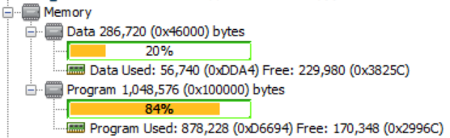

# Frequently Asked Questions: Secure Cloud Connectivity and Voice Control Demo for Microchip WFI32-IoT Board

Devices: **| PIC32 WFI32E | WFI32 | Trust\&Go (ECC608) |**

Features: **| Secure Cloud connectivity | Voice Control |**

 
#### 1.  The board is not able to connect to the cloud from my office network

The most common issue in this scenario is the firewall configurations of the office network. Cloud connection is done over the secure MQTT port 8883. Many office firewalls block this port. Please talk to the IT department of your office to allow port 8883 in your firewall.

#### 2.  Why am I not able to connect to an access point configured to use channel 13

For regulatory compliance, the OOB demo is configured to use RF channels that works worldwide. Since channel 13 is restricted in some countries, it is disabled. Refer to the device software user guide to get information about regulatory domain selection APIs.

#### 3.  Why is temperature value reported by the board is higher than my actual room temperature?

The tempertaure reading reported by the board reflects board temperature and not room temperature. Board temperature is relatively high because of high current due to multiple components drawing relatively high current (i.e USB Hub and PKOB4).

#### 4.  What is the flash and RAM usage of the demo?

#### 5.  What is the flash and RAM usage in normal Vs MicroMIPS modes?

When compiled in microMIPS mode and used with MPLAB XC license to enable *Os* Optimization level, program memory savings of around **20% (201.2 KB)** can be observed.

#### 6.  How to enable compiler MicroMIPS modes?

GCC and Linker settings in the Project Properties are highlighted below:

