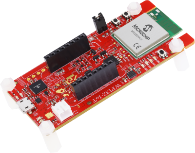
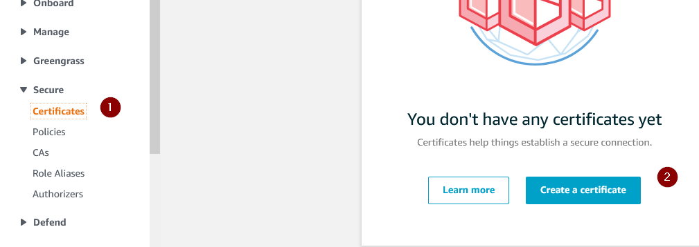

# Application Deep Dive: Secure Cloud Connectivity and Voice Control Demo for Microchip WFI32-IoT Board

Devices: **| PIC32 WFI32E | WFI32 | Trust\&Go (ECC608) |**

Features: **| Secure Cloud connectivity | Voice Control |**

[](https://github.com/MicrochipTech/WFI32-IoT/releases/latest)

The WFI32-IoT board comes pre-programmed and configured for demonstrating the connectivity to the AWS Cloud IoT Core. The demo uses **AWS C SDK version 4.0** to establish MQTT connection to AWS broker, subscribe to cloud topic/s and publish to the cloud.

<p align="center">

</p>

Please check out our **[Quick Start Guide](https://github.com/MicrochipTech/WFI32-IoT/blob/main/README.md)** to experience an out-of-the-box cloud connection to Microchip AWS Sandbox account. We have also gathered some FAQs and troubleshooting tips for you under the **[FAQ and Troubleshooting Page](https://github.com/MicrochipTech/WFI32-IoT/blob/main/FAQ.md)**.

## Table of Contents

1. [Requirements](#chapter1)
2. [Application Scope](#chapter2)
3. [Application Structure](#chapter3)
4. [Application Description](#chapter4)
5. [Secure Provisioning & Transport Layer Security](#chapter5)
6. [Understanding the Device Shadow in AWS](#chapter6)
7. [Connecting to Your Cloud Instance](#chapter7)
8. [Re-flash the demo](#chapter8)
9. [Code generation using Harmony 3](#chapter9)
10. [Power Save Modes](#chapter10)

## 1. Requirements <a name="Chapter1"></a>

* **MPLAB® X Integrated Development Environment (IDE) v5.40 or later**
MPLAB® X IDE is a computer software program based on the open source NetBeans IDE from Oracle. It is used to develop applications for Microchip microcontrollers and digital signal controllers. It runs on Windows®, Mac OS® and Linux®. 
For the latest version, please refer to: [MPLAB-X](https://www.microchip.com/mplab/mplab-x-ide)

* **MPLAB® XC32 Compiler v2.41 or later**
MPLAB® XC compilers support all of Microchip’s PIC, AVR and dsPIC devices where the code is written in the C programming language. XC32 is the recommended compiler for 32-bit PIC MCUs. In this lab, as well as with the succeeding labs, you will be using MPLAB® XC32 for an PIC MCU.
For the latest version, please refer to: [XC-Compiler](https://www.microchip.com/mplab/compilers)

* **WFI32-IoT Board**
The WFI32-IoT board is a compact, easy-to-use development board that supports rapid prototyping of IoT devices and demonstrates cloud connectivity with voice control enablement. This kit is also a useful tool to evaluate the features of WFI32E01PC, the single-chip Wi-Fi module. The board also includes an on-board debugger and requires no external hardware to program and debug the MCU.

---

## 2. Application Scope <a name="Chapter2"></a>
The WFI32-IoT-IoT development board has been created with the intention of demonstrating a one source solution for evaluation of existing cloud provider solutions. 
This example end-device leverages the catalog of devices, and libraries provided through Microchip's extensive product line to showcase a basic Internet of Things product connection. Data exchange between server and in field device is implemented using on board sensors for temperature and light value observations. Behavior actions are demonstrated through visual indication of the 'Data' LED as controlled through the Web based APIs. 

General Out-Of-Box operation is as described below:
1. Use the WFI32E01PC single-chip WiFi module to establish local WiFi connection to Router/Switch or Network source. The **Blue 'Wi-Fi' LED** is used to indicate this status. 
2. The on-module ATECC608A HSM is used to establishe a Secure (TLS) Socket Connection with select Cloud Provider using a TCP connection. The **Green 'Connect' LED** is used to indicate this status
3. Using **AWS C SDK**, data is exchanged between client (end-device) and broker (cloud). 
4. Sensor Data is sent as Telemetry Data between device and broker at a periodic rate of 1 Second. The **Yellow 'Data' LED** blinks to indicate this status. 
5. Capture of Data sent from Broker to Device can be observed through a Serial terminal when USB-Micro is connected to WFI32-IoT board. 
6. Behavior variation can be observed on the 'Data' LED when triggered through the web based API and sent through the broker to end device.

**Note**: The **SW1 & SW2** user buttons have no effect outside of variation of start-up operation where:
* **SW1** held during boot-up: Enter Soft AP mode.
* **SW1 & SW2** held during boot-up: Use factory default configuration. Default Wi-Fi credentials are {**MCHP.IOT, microchip**}

**Note**: The **Red 'Data' LED** remaining on may indicate a hardware fault.

---

## 3. Application Structure <a name="Chapter3"></a>

The application runs multiple logical modules as follows:

| App Logical Module		| Source/Header Files 	| Role                                                                          	|
| ----------------------------- | --------------------- | ------------------------------------------------------------------------------------- |
| **APP**			| app.c/.h		| The main/central module that manages **Wi-Fi functionality**.              		|
| **APP_WIFI_PROV**		| app_wifi_prov.c/.h	| Manages **AP provisioning functionality** to provision the device using AP mode	|
| **APP_USB_MSD**		| app_usb_msd.c/.h	| Manages **Mass Storage Device functionality**(*) |
| **APP_CTRL**			| app_ctrl.c.h		| Manages device **Control operations** including LED management and sensors access	|
| **APP_AWS**			| app_aws.c/.h		| Manages **AWS cloud connection/subscribe/publish functionality**			|
| **APP_COMMANDS**		| app_commands.c/.h	| Manage **User commands given via command line**					|
| **APP_OLED**	| app_oled.c/.h	| Manage **OLEDB click board**	|
| **APP_PS**	| app_ps.c/.h	| Manage different **power save** modes	|

(*) **Mass Storage Device** gives access to:
* Configure the device for Wi-Fi connection via **WIFI.CFG**.
* configure the device for cloud connection via **cloud.json**.
* Demo Webpage via **clickme.html**.
* Device registration for Alexa Voice control via **voice.html**.

---

## 4. Application Description <a name="Chapter4"></a>

### AWS Cloud
* Publish payload for sensor data (telemetry)
	* topic: ``<thingName>/sensors ``
	* payload: 
	```json
	{
	  "Light": lightValue,
	  "Temp": temperatureValue
	} 
	```
* Device publishes payload to update the Device Shadow
	* topic: ``$aws/things/<thingName>/shadow/update``
	* payload:
	```json
	{
	  "state":
	  {
	       "reported":
	       {
		    "toggle": updatedToggleValue
	       }
	  }
	}
  ```
* Web Interface publishes payload to Device Shadow
	* topic: ``$aws/things/<thingName>/shadow/update``
	* payload:
	```json
	{
	  "state":
	  {
	       "desired":
	       {
		     "toggle": toBeUpdatedToggleValue
	       }
	  }
	}
	```
* Device subscribes to delta to receive actionable changes
	* topic: ``$aws/things/<thingName>/shadow/update/delta``
	* payload:  
	```json
	{
	   "state":
	  {
	       "Light": lightValue,
	  }
	}
	```
* The WFI32-IoT board publishes data from the on-board light and temperature sensor every 1 second to the cloud.
* The data received over the subscribed topic is displayed on a serial terminal and **YELLOW LED blinks** accordingly.

### Establish MQTT connection to cloud  
* File: **src/app_aws.c**.
* App function: ``APP_AWS_Tasks``
* AWS C SDK API: ``IotMqtt_Connect``

### Sending MQTT publish packets  
* File: **src/app_aws.c**
* App function: ``publishMessage``
* AWS C SDK API: ``IotMqtt_PublishAsync``

### Subscribe to topic/s
* File: **src/app_aws.c**
* App function: ``APP_AWS_Tasks``
* AWS C SDK API: ``IotMqtt_SubscribeSync``

### Processing Packets received over subscribed topic
* File: **src/app_aws.c**
* App function: ``MqttCallback``

---

## 5. Secure Provisioning & Transport Layer Security <a name="Chapter5"></a>

1. The WFI32-IoT board is shipped pre-provisioned for coordination with the AWS Cloud system.
2. Security is achieved by using the WolfSSL Transport Layer Security (TLS) stack configured within Harmony 3 eco-system.
3. A Pre-Manufacturing process has configured the appropriate slot locations on the ATECC608A HSM.
4. All required certificates used for signing and authentication have been written to and 'locked' into allocated slots.
	* This process is achieved through: [Trust&Go](https://www.microchip.com/design-centers/security-ics/trust-platform/trust-go)
	* Full scope of support for Secure Aspects of development can be found here: [Trust Platform](https://www.microchip.com/design-centers/security-ics/trust-platform)
5. This process has been performed to allow for an Out Of Box (OOB) operation of the WFI32-IoT board along with supporting web page.
6. Shadow Topic are a key application feature being supported through WFI32-IoT demo. Further reference can be found here: [Shadow MQTT Topics](https://docs.aws.amazon.com/iot/latest/developerguide/device-shadow-mqtt.html)

---

## 6. Understanding the Device Shadow in AWS <a name="Chapter6"></a>

1. The AWS broker allows for the use of Shadow Topics. The Shadow Topics are used to retain a specific value within the Broker, so End-Device status updates can be managed.

 	* Shadow Topics are used to restore the state of variables, or applications.
 	* Shadow Topics retain expected values, and report if Published data reflects a difference in value.
 	* When difference exist, status of the delta is reported to those subscribed to appropriate topic messages.

2. Updates to the device shadow are published on ``$aws/things/{thingName}/shadow/update`` topic.  When a message is sent to the board by changing the value of the **toggle** button in **Control Your Device** section:
	* This message is published on the ``$aws/things/{thingName}/shadow/update topic``. 
	* If the published value of **toggle** is different from the **toggle** value present in the AWS Device Shadow, the AWS Shadow service reports this change to the device by publishing a message on ``$aws/things/{thingName}/shadow/update/delta`` topic.
	* The JSON structure of the message sent should appear as below
	```json
	{
	  "state": {
	    "desired": {
	      "toggle": toBeUpdatedToggleValue
	    }
	  }
	}
	```
3. The meta data, and delta difference will be reported via the Serial Terminal upon a difference between desired/reported.


4. In response to this, the end device publishes a message to ``$aws/things/{thingName}/shadow/update`` topic.
	* This message is published to **report** the update to the **toggle** attribute.
	* The JSON structure of the message sent should appear as below
	```json
	{
	  "state": {
	    "reported": {
	      "toggle": updatedToggleValue
	    }
	  }
	}
	```

5. Application flow when using the device shadow


6. You can read more about AWS device shadows [here](https://docs.aws.amazon.com/iot/latest/developerguide/device-shadow-data-flow.html).

---

## 7. Connecting to Your Cloud Instance <a name="Chapter7"></a>

By default, the demo connects to an instance of AWS IoT maintained by Microchip. The demo lets you move the device connection between your cloud instance, and the Microchip maintained AWS IoT instance without a firmware change. Perform the following steps to get the device connected to your own cloud instance.

1. Create an AWS account or log in to your existing AWS account. Please refer to [Set up your AWS account](https://docs.aws.amazon.com/iot/latest/developerguide/setting-up.html) and [Create AWS IoT resources](https://docs.aws.amazon.com/iot/latest/developerguide/create-iot-resources.html) for details.

2. Navigate to [IoT Core console](https://console.aws.amazon.com/iot/) \> Manage \> Things and click on **Create**/ **Register a Thing**


3.  Select **Create a single thing**

4.  For thing name, copy and paste the thing name from the original demo web-app. This thing name originates from the device certificate and is used by the firmware to send messages to a unique topic.


5.  Select defaults for the other fields and click **Next** at the bottom of the page.

6.  Select **Create thing without certificate** in the next page.

7.  Go to **Secure** \> **Policies** and select **Create a Policy**.


8.  Create a new policy which allows all connected devices to perform all actions without restrictions

**Note**: This policy grants unrestricted access for all iot operations, and is to be used only in a development environment. For non-dev environments, all devices in your fleet must have credentials with privileges that authorize intended actions only, which include (but not limited to) AWS IoT MQTT actions such as publishing messages or subscribing to topics with specific scope and context. The specific permission policies can vary for your use cases. Identify the permission policies that best meet your business and security requirements.Please refer to [sample policies](https://docs.aws.amazon.com/iot/latest/developerguide/example-iot-policies.html) and [security best practices](https://docs.aws.amazon.com/iot/latest/developerguide/security-best-practices.html).

| Item               | Policy Parameter |
| ------------------ | ---------------- |
| **_Name_**         | allowAll         |
| **_Action_**       | iot:\*           |
| **_Resource Arn_** | \*               |
| **_Effect_**       | Allow            |


9.  Navigate to **Certificates** \> **Create a certificate**



10. Select Create with **Get Started** under **Use my certificate**.

11. In the next screen, click **Next** without making any selections.

12. Click on **Select certificates**.

13. On the **Curiosity drive**, you can find a **xx.CER** file with an alphanumeric name. Select this file when prompted to select a certificate.

14. Select **Activate all** and click **Register certificates**.


15. Select the certificate and
	1.  Click **Attach policy** and select the **allowAll** policy we created.
	2.  Click **Attach thing** and choose the **thing** we created.


16. Navigate to **Settings** and copy the endpoint URL


17. On the **Curiosity drive**, open **cloud.json**.

**Note**: While editing **cloud.json** or **WIFI.CFG** manually, it is recommended to use **Notepad** . Other editors like **Notepad++** can damage the underlying FAT12 FS. You can read more about this generic issue in the discussion [here](https://github.com/adafruit/circuitpython/issues/111). In case you come across this, please re-flash the image to recover.

18. Replace the **Endpoint** attribute with the endpoint URL and save.

19. Reset the device. Now, the device will connect to your own cloud instance.

20. In the AWS IoT console, navigate to **test** and subscribe to topic **+/sensors**


21. You will be able to observe periodic temperature and light data coming into the console from your device.

22. To control the **Yellow LED**, publish the following message:

	* topic: ``$aws/things/<thingName>/shadow/update``
	* payload:
	```json
	{
	  "state":
	  {
	       "desired":
	       {
		     "toggle": toBeUpdatedToggleValue
	       }
	  }
	}
	```

23. Depending on the value of **toggle**, the **Yellow LED** will be on/off for 2 seconds.

---

### 8. Re-flash the demo <a name="Chapter8"></a>
In case you want to re-flash the device, perform the following steps:

1. Download and install [MPLABX Integrated Programming Environment](https://www.microchip.com/mplab/mplab-integrated-programming-environment).
2. Download the latest FW image (hex file) from the [releases](https://github.com/MicrochipTech/PIC32MZW1_Curiosity_OOB/releases/latest) tab.
2. Connect WFI32-IoT board USB to your PC.
3. Open MPLABX IPE.


4. Select **PIC32MZ1025W104132** device and **PKOB** tool then click on **Connect**.


5. **Browse** your PC to load the downloaded hex file into IPE.
6. Click on **Program** in the IPE and wait for device programming to complete.

---

### 9. Code generation using Harmony 3 <a name="Chapter9"></a>

To add additional features to the OOB demo, you might have to regenerate the demo code using Harmony3 after adding additional components or changing the existing configuration.
Ensure that you use the same version or Harmony 3 components used in the original demo codebase while regenerating code. You can see the version dependencies of the demo in `harmony-manifest-success.yml` file found at `WFI32-IoT\demo\cloud_sdk_demo\firmware\src\config\aws_sdk_wfi32_iot_freertos` into Harmony3 content manager. 

In case of a mismatch between the Harmony 3 components present in the demo and the ones available in disk, Harmony3 Configurator will popup a warning screen during launch. In the case of the sample shown below, the `Wireless` component available in disk is older `3.3.1` while the version used in the project is `3.4.0`. 

<p align="center">

</p>

It is recommended to use the same versions used in the project while regenerating the project. 

To sync your Harmony3 setup to match the versions used in the demo, follow these steps:

1. Open Harmony3 Content manager
2. Navigate to `Local Packages` and click on `Load manifest file`

3. When you select the project manifest file, the required versions of Harmony3 dependencies will be checked out by content manager.

4. Close content manager and open the Harmony configurator to continue.


<p align="center">

</p>

While generating code, make sure that you use “USER_ALL” merge strategy.

The default demo code includes some changes to the generated “net_pres_enc_glue.c” file. Make sure that you retain the changes shown in the images below during code generation. These changes are to enable support for ECC608 TNGTLS in the TLS flow. If the right dependencies are loaded, there should not be any additional merges while regenerating code without any configuration change.

<p align="center">

</p>

---

### 10. Power Save Modes <a name="Chapter10"></a>
WFI32-IoT OOB demo supports following low power modes:
- PIC sleep modes: Extreme Deep Sleep mode (XDS), Deep Sleep mode (DS), Sleep and Idle
- WI-FI sleep modes: Connected sleep mode (WSM), Wi-Fi off (WOFF).

#### Deep Sleep Mode
By default, OOB demo is configured to run into deep sleep mode (DS). Power peripheral library configuration details for DS mode is shown below in Harmony3 configurator project graph:
<p align="center">

</p>
DS mode supports both RTCC and EXT INT0 (SW1 button press) as a wakeup source. Under this MHC configuration, you can use command line to choose between different PIC and Wi-Fi sleep modes as follows:

**power_mode <power_mode>**

|               | **PIC Power Mode** 	| **Wi-Fi Power Mode** 	|
| ------------- | --------------------- | --------------------- |
| **0**		| IDLE       	 	| WSM_ON		|
| **1**		| IDLE	      		| WOFF			|
| **2**       	| SLEEP		   	| WSM_ON		|
| **3** 	| SLEEP               	| WOFF               	|
| **4** 	| DS/XDS               	| -               	|
| **5** 	| -               	| WON               	|

**Note**: RTCC default frequency is 1 second. Once you call "**power_mode**" command, this changes to 10 seconds. You can always change RTCC frequency using command line:
**rtcc_freq <freq_val>**

#### Extreme Deep Sleep Mode
In case you want to enable extreme deep sleep mode (XDS), then below modification to Power peripheral library Harmony3 configuration is needed:
<p align="center">

</p>
XDS mode supports only EXT INT0 (SW1 button press) as a wakeup source.

Following command is used to enter XDS sleep mode:
**power_mode 4**
