# Quick Start Guide: Secure Cloud Connectivity and Voice Control Demo for Microchip WFI32-IoT Board.

Devices: **| PIC32 WFI32E | WFI32 | Trust\&Go (ECC608) |**

Features: **| Secure Cloud Connectivity | Voice Control |**

 
The WFI32-IoT board comes pre-programmed and configured for demonstrating the connectivity to the AWS Cloud IoT Core. The demo uses **AWS C SDK version 4.0** to establish MQTT connection to AWS broker, subscribe to cloud topic/s and publish to the cloud.

## Table of Contents

1. [Overview](#chapter1)
	1. 	[Board Layout](#chapter1.1)
	2.	[OOB Flow](#chapter1.2)
	3.	[Switch Button Use Cases](#chapter1.3)
2. [Getting Started](#chapter2)
	1.	[Connecting the Board to the Host PC](#chapter2.1)
	3.	[Connecting the Board to Wi-Fi Networks](#chapter2.2)
		1. 	[Via WFI32-IoT Web page](#chapter2.2.1)
		2. 	[Via Soft AP](#chapter2.2.2)
	4.	[Visualizing Cloud Data in Real Time](#chapter2.3)
	5.	[Voice Control](#chapter2.4)
3. [Want To Know More?](#chapter3)

## 1. Overview 

### 1.1 Board Layout 
The WFI32-IoT board layout can be seen below.

### 1.2 OOB flow 

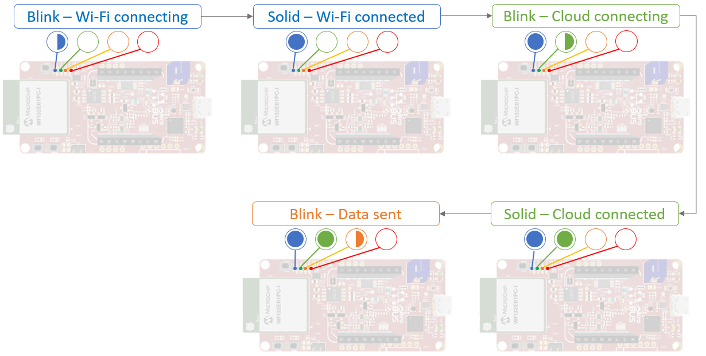

If you have an [OLEDB Click board](https://www.mikroe.com/oled-b-click) connected to the WFI32-IoT board's Click interface, the OLED board will:
1. Show **Wi-Fi icon/image** once board is Wi-Fi connected.
2. Show additionally **Cloud icon/image** once board is Cloud connected.

### 1.3 Switch Button Use Cases 
* **SW1** held during boot-up: Enter Soft AP mode (indicated by **Slow Blinking BLUE LED**).
* **SW1 & SW2** held during boot-up: Use factory default configuration. Default Wi-Fi credentials are {**MCHP.IOT, microchip**}.

---

## 2. Getting Started 

### 2.1 Connecting the Board to the Host PC 
1. Connect the WFI32-IoT board to a PC using a standard micro-USB cable. 
2. The LED array will blink twice in the following order: **BLUE --> GREEN --> YELLOW --> RED**. 
3. The board will appear as a removable storage device on the host PC
4. Double-click on the **clickme.html** file to go to the demo webpage.

### 2.2 Connecting the Board to Wi-Fi Networks 

#### 2.2.1 Via WFI32-IoT Webpage 
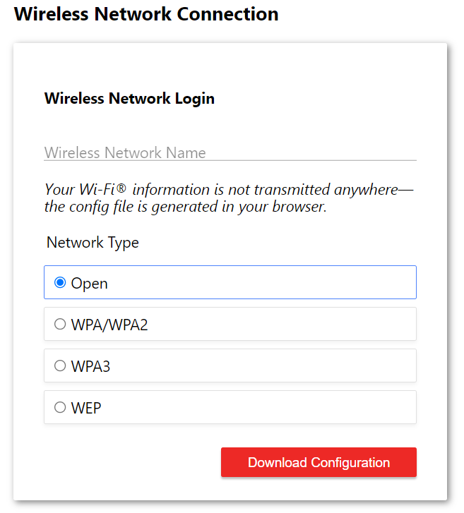

1. The lower left-hand corner of the webpage will show a wireless network connection window.
2. Enter your AP credentials and click the **Download Configuration** button. 
3. A file named **WIFI.CFG** (text) file is downloaded to the host PC. 
4. Drag and drop the file to the **CURIOSITY drive** to update the Wi-Fi credentials of the board.
5. Reboot the device.
6. **Fast Blinking BLUE LED** indicates connecting to local AP and **solid BLUE LED** indicates connection is successful.

**Note**: Any information entered in the SSID and password fields is not transmitted over the web or to the Microchip or AWS servers. Instead, the information is used locally (within the browser) to generate the **WIFI.CFG** file.
 
#### 2.2.2 Via Soft AP 
1. Download **Microchip Wi-Fi Provisioning** Mobile phone application for [Android](https://play.google.com/store/apps/details?id=com.microchip.wifiapplication&hl=en_US&gl=US) or for [iOS](https://apps.apple.com/us/app/wi-fi-provisioning/id1553255731).
2. To enter SoftAP mode, hold the **SW1** push button for most of the power up time.
3. **Slow Blinking BLUE LED** indicates Soft AP is available.
5. Using the Mobile phone or tablet, connect to the **WFI32-IoT** AP. 
6. Open **Microchip Wi-Fi Provisioning** Mobile phone application and press **CONNECT**.

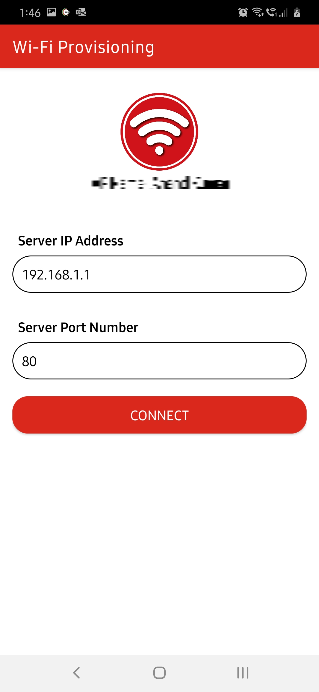

7. Mobile app doesn't currently have native support for Wi-Fi provisioning for WPA3 enabled APs. If your AP security mode is WPA3, please jump to [step 14](#step14).
8. List of available APs is shown. You can press **SCAN** button to refresh.

**Note**: For iPhone/iPad, you have to provide your own AP crednetials as **SCAN** function is not supported due to iOS limitation.

**Note**: Make sure you have location service in your phone enabled. Location service is needed by the application to be able to fetch Wi-Fi scan results (Android only), AP name and default Gateway.

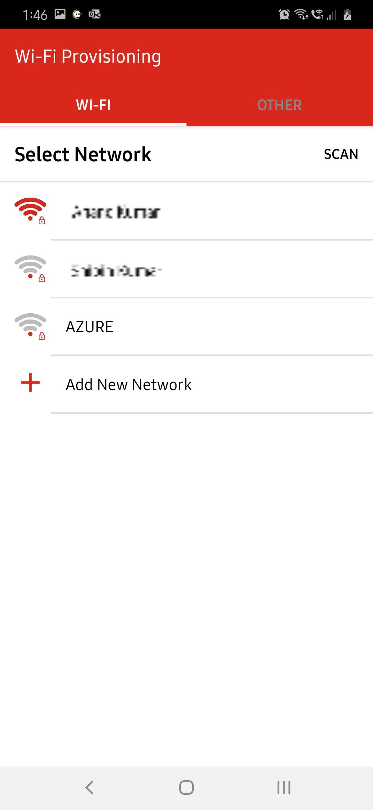

9. Choose one of the scanned APs or provide your own AP crednetials. Data provided is sent to the WFI32-IoT board as you press **SEND**. 

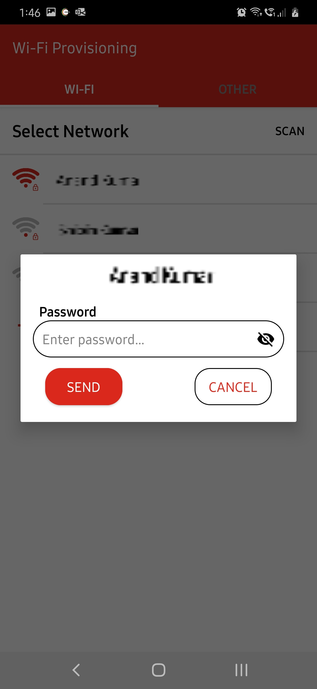
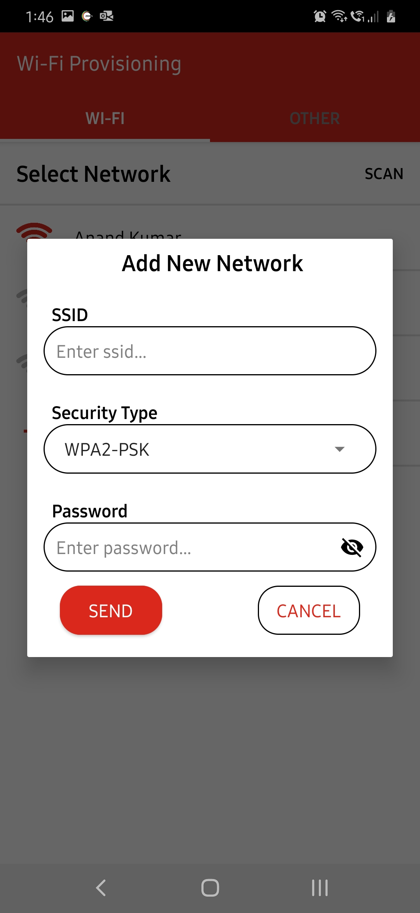

10. Go back in the app and press **YES** when prompted so that the WFI32-IoT board applies the new credentilas.

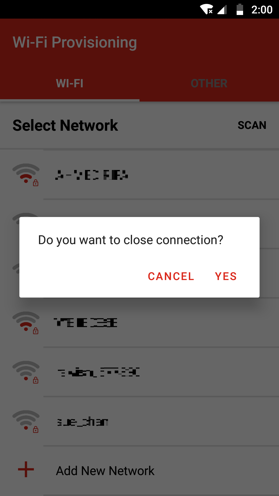

12. Device should automatically reboot.
13. **Fast Blinking BLUE LED** indicates connecting to local AP and **solid BLUE LED** indicates connection is successful.

##### For WPA3-enabled AP: 
14. Navigate from **Wi-Fi** tab to **OTHER** tab and type in the following string without the double quotations: "*apply,ssid,password,4*". Please replace *ssid* with your AP name and *password* with your AP password. Press **SEND** when done.
	
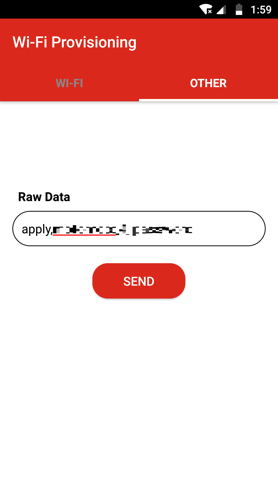
	
15. Go back in the app and press **YES** when prompted so that the WFI32-IoT board applies the new credentilas.
	
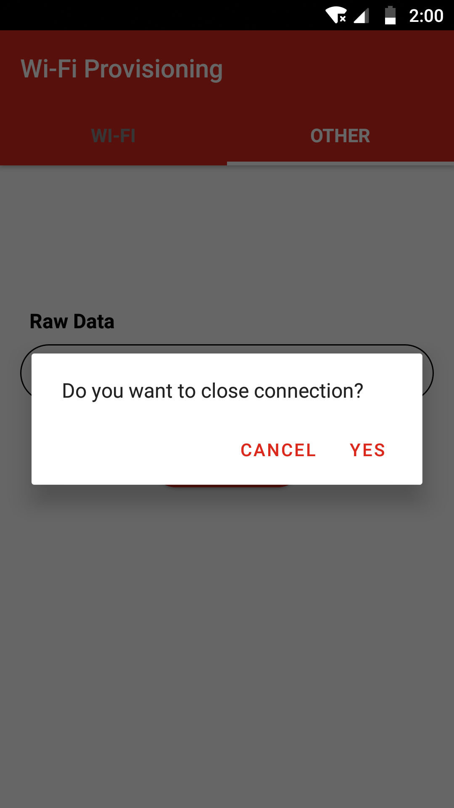

**Note**: WFI32-IoT board will NOT apply/use provided credentials unless you go back in the app. This gives you the chance to keep sending new credentials or correct wrongly provided ones as long as you didn't go back in the app.

### 2.3 Visualizing Cloud Data in Real Time 

#### Viewing the published messages

1. After connecting to an access point, WFI32-IoT board will try to connect to Microchip AWS Sandbox account which is indicated by a **blinking GREEN LED**.
2. Once connection to cloud is successful, **GREEN LED** will turn solid.
3. Go to demo webpage (can always be reached out using the file **clickme.html**).
4. The webpage will show a real-time graph of the data captured from the on-board light and temperature sensors.
5. The on board **YELLOW LED** will blink for 300 ms for each message published successfully to the cloud.

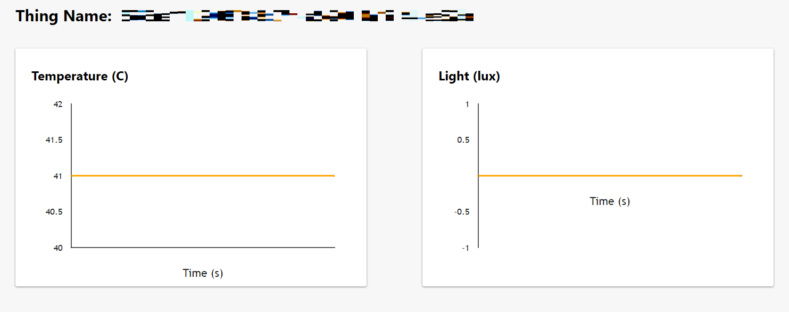

**Note**: Take note of your Thing Name as it's going to be noted for registering the device for Alexa Voice Control in [section 2.4](#chapter2.4).

#### Sending messages to the board
1. Click on **What's Next** button below the Temprature and Light graphs.
2. Select **Implement a Cloud-Controlled Actuator** to demostrate cloud performed behaviors.

3. Click on **Learn More** button to expand page interface then Scroll to the bottom of **Step 5** where a panel will read **Control Your Device**.

4. By default only a **Toggle** feature is demostrated. Custom implmentations are described further on above the panel.

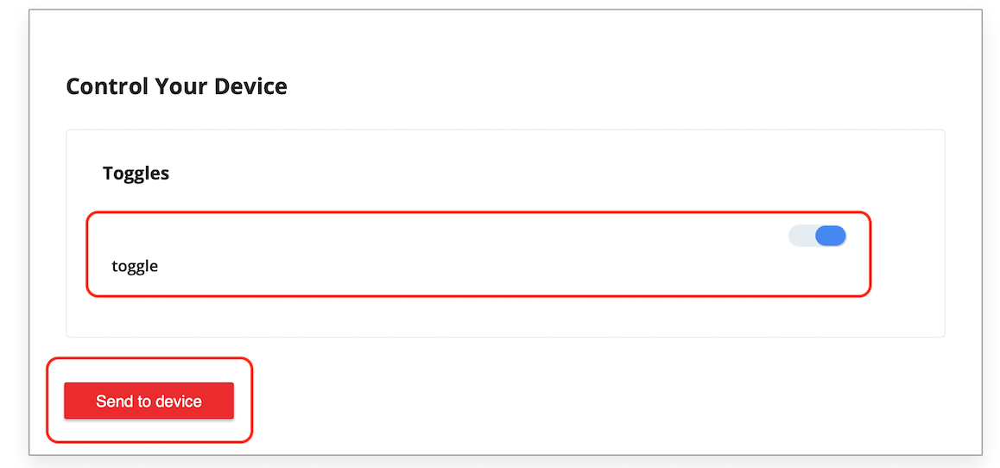

5. Click on **Send to device** to send **Toggle** button value. 
6. The **YELLOW LED** will remain on/off for 2 seconds when **Toggle** button is selected/unselected, respectively. After the 2 seocnds, the **YELLOW LED** will go back to its normal functionality; blinking on each successfull message published to the cloud.

**Note**: Because Toggle manipulates the desired stat, the state must be changed to observe the behavior.

### 2.4 Voice Control 
Please note that supported browsers inlcudes Google Chrome, Mozilla Firefox, Safari, and Microsoft Edge while Internet Explorer is not supported. Please also note that only devices registered to the Microchip Cloud account can be registered for voice control and controlled via the voice skills. In case of registration errors, please contact [Microchip support](http://microchip.com/support)

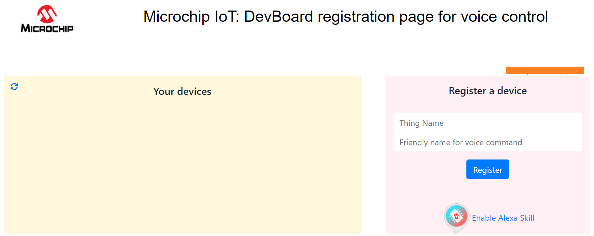

1. Create an account and log-in to the [device registration page](https://microchiptech.github.io/mchpiotvoice/). You can also reach out to this page using the file **voice.html** on the **CURIOSITY drive**.

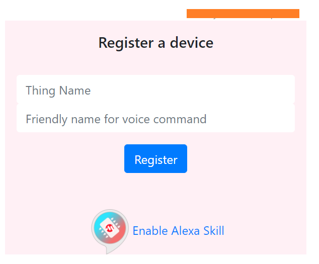

2. Enter your thing name and a friendly name and claim your device by registering it. Thing name can be found at the top of the demo web page just above the temperature and light graphs.

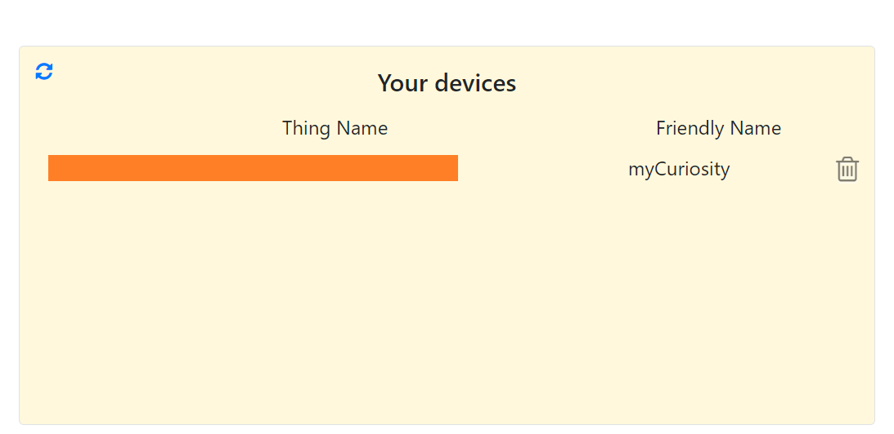

3. Successfully claimed devices will show up in the device listing in the left side panel.
4. Using Amazon Alexa® app, enable the skill ' [Microchip IoT](https://www.amazon.com/gp/product/B08B5THZH5?ref&ref=cm_sw_em_r_as_dp_iuhtblwcTlYL4)' and add the dev board as a smart home device.   
5. You can now control the on-board **YELLOW LED** with voice commands using the friendly name provided while claiming the device earlier:
> Alexa, turn on the myCuriosity
6. The **YELLOW LED** will remain on/off for 2 Seconds based on the voice command.
   
**Note**: You can find out more information about connecting a smart home device to Alexa from [this link](http://tinyurl.com/alexa-smart-home)
 
**Note**: Supported browsers inlcude Google Chrome, Mozilla Firefox, Safari, and Microsoft Edge while Internet Explorer is not supported. 
 
**Note**: Only devices registered to the Microchip Cloud account can be registered for voice control and controlled via the voice skills. In case of registration errors, please contact [Microchip support](http://microchip.com/support)

## 3. Want To Know More? 

Curious to learn more? ..
- Check out our **[Deep Dive Guide](https://github.com/amrabdelmoghny/WFI32-IoT/blob/main/HowItWorks.md)** to dive behind the scenes, learn how Connectivity, Security and Cloud are tied together and experience how smooth it is to migrate the demo to your own cloud instance. 
- We have gathered some FAQs and troubleshooting tips for you under the **[FAQ and Troubleshooting Page](https://github.com/amrabdelmoghny/WFI32-IoT/blob/main/FAQ.md)**. 
- Refer to WFI32-IoT board **[HW user guide]()**. 
- Check out **[WFI32E01PC module Product page](https://www.microchip.com/wwwproducts/en/WFI32E01PC)** for tips, guides, knowledge base article, code examples and further more!
- Check out **[Curisoity Board](https://www.microchip.com/developmenttools/ProductDetails/PartNO/EV12F11A)**; another evaluation board for WFI32E01PC module where you can have access to more module interfaces (i.e Ethernet) and more pins for prototyping. 
- A very similar and exciting demo for Curisoity Board is available **[here](https://github.com/MicrochipTech/PIC32MZW1_Curiosity_OOB)**.
